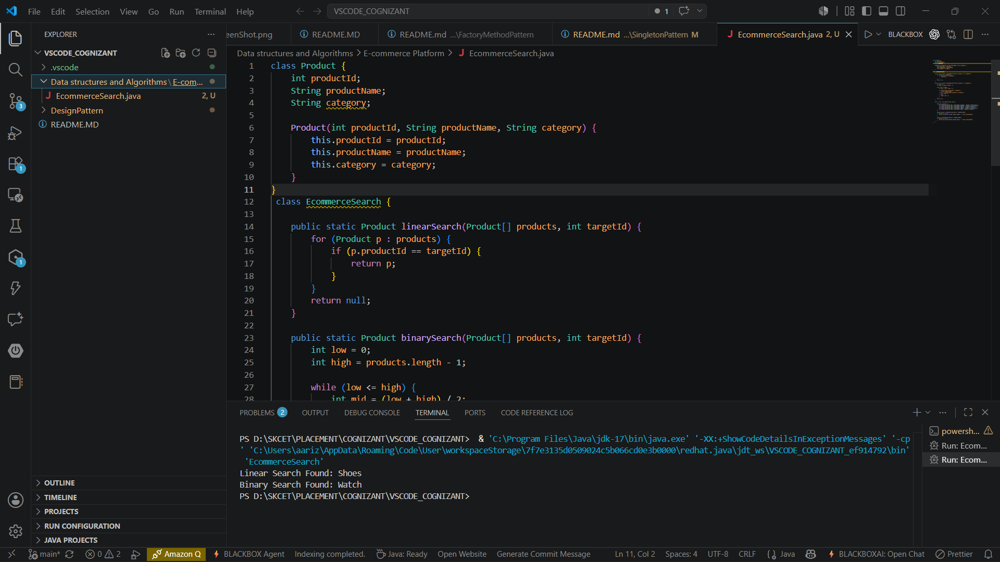

# E-commerce Platform Search Function

## Objective

Implement Linear Search and Binary Search algorithms to search products efficiently in an e-commerce platform.

## Scenario

An e-commerce application needs a fast search feature to find products using their product ID.

## Files

* EcommerceSearch.java

## Implementation

* Created a Product class with productId, productName, and category.
* Implemented Linear Search for searching products sequentially.
* Implemented Binary Search for searching products in a sorted array.
* Compared the performance of both search algorithms.

## Output

```text
Linear Search Found: Shoes
Binary Search Found: Watch
```

## Output Screenshot



## Result

Linear Search and Binary Search implemented successfully.
