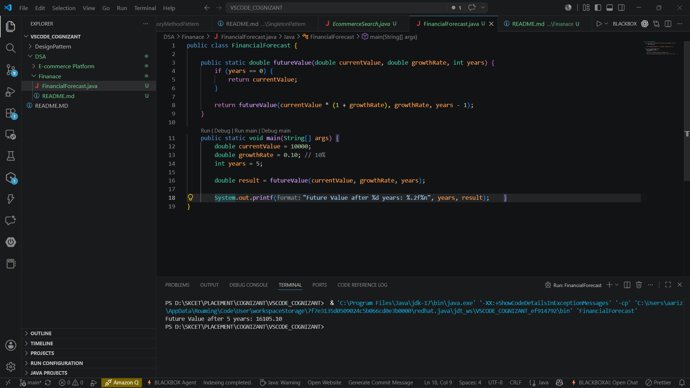

# Financial Forecasting

## Objective

Implement a recursive algorithm to predict future financial values based on growth rates.

## Scenario

A financial forecasting tool predicts future values using historical growth rates.

## Files

* FinancialForecast.java

## Implementation

* Used recursion to calculate future value.
* Applied growth rate for each year recursively.
* Displayed the predicted future value.

## Output

```text
Future Value after 5 years: 16105.1
```

## Output Screenshot



## Result

Financial forecasting using recursion implemented successfully.
