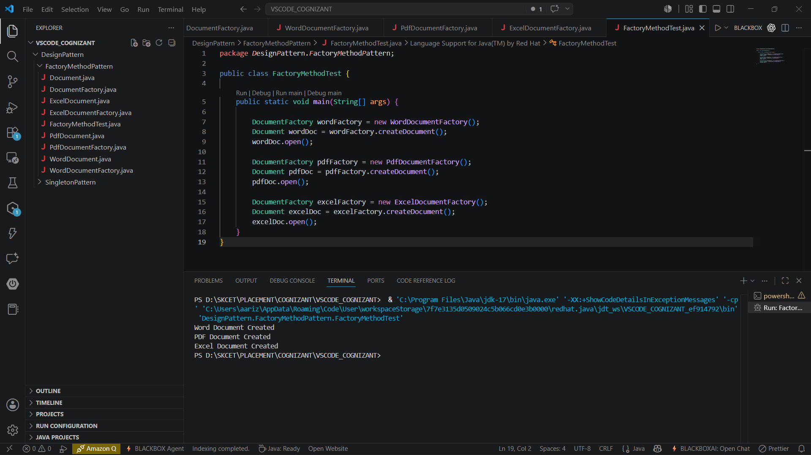

# Factory Method Pattern

## Objective
Implement the Factory Method Design Pattern to create different types of documents without specifying their concrete classes.

## Scenario
A document management system needs to create different document types such as:
- Word Document
- PDF Document
- Excel Document

The Factory Method Pattern is used to delegate object creation to factory classes.

## Files
- Document.java
- WordDocument.java
- PdfDocument.java
- ExcelDocument.java
- DocumentFactory.java
- WordDocumentFactory.java
- PdfDocumentFactory.java
- ExcelDocumentFactory.java
- FactoryMethodTest.java

## Implementation
- Created a Document interface.
- Implemented WordDocument, PdfDocument, and ExcelDocument classes.
- Created an abstract DocumentFactory class.
- Implemented separate factory classes for each document type.
- Tested document creation using the factory method.

## Output

```text
Word Document Created
PDF Document Created
Excel Document Created
```

## Output Screenshot



## Result
Factory Method Pattern implemented successfully.